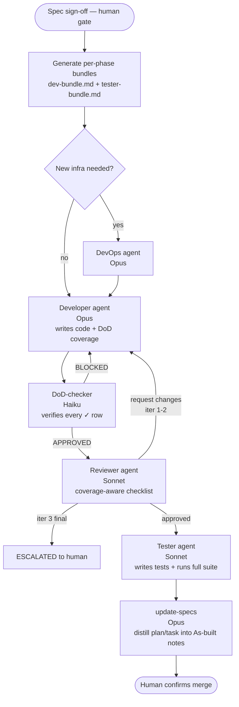
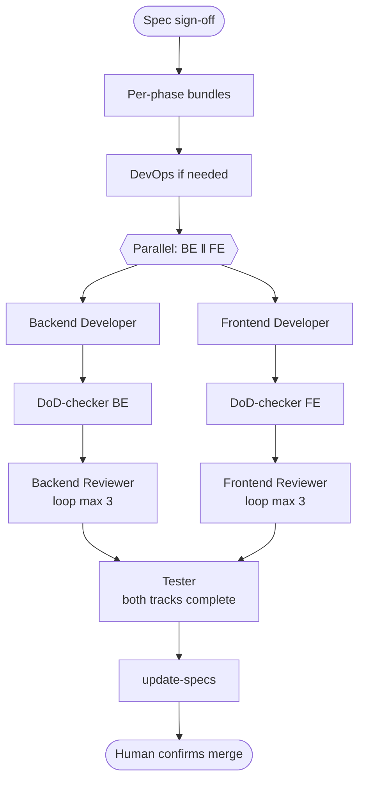

import { Aside } from '@astrojs/starlight/components';

`/build-plan` is the orchestrator. It takes a refined spec + plan + task and runs the work through a deterministic agent pipeline. Every agent is an isolated subagent with its own context window — they never share memory; communication happens via structured handoff files.

## The flow

The pipeline shape depends on the plan's `Complexity:` classification.

### Standard flow (default)



### Complex flow (multi-service features)

When the feature touches both backend and frontend, the orchestrator runs Backend and Frontend tracks in parallel. Each track has its own DoD-checker and Reviewer; the Tester runs once at the end against both completed tracks.



### Simple flow

For trivial diffs (typo fix, copy edit, single-rule refactor) the orchestrator collapses Developer + Tester into a single agent and skips the DoD-checker (the agent runs the DoD verification gate inline). Optional Reviewer based on whether the agent flags `## Open Questions`.

## Agent isolation

Each agent runs as a separate `Agent` tool spawn. The subagent:

- Starts with a clean context (does NOT inherit the orchestrator's history).
- Reads only the files listed in its prompt's reading order.
- Writes one handoff file with a [structured Status block](/ai-standards/concepts/status-block-contract/).
- Cannot ask the human directly — ambiguities surface via `## Open Questions` + `Status: blocked` in the handoff, which the orchestrator reads and surfaces between phases.

This isolation is the design's main lever for token cost. The orchestrator's context grows with each phase's handoff, but every subagent stays small.

## Status gate

Between every phase, the orchestrator parses the previous handoff's `## Status` block:

| Value | Behaviour |
|---|---|
| `complete` | Advance to next phase |
| `blocked` | Stop, surface `## Open Questions` to human |
| `failed` | Stop, report `## Status reason` to human |
| `incomplete` | Stop, ask human (retry vs accept) |
| Absent / unrecognised | Treat as `failed` — fail-loud safe default |

See [the Status block contract](/ai-standards/concepts/status-block-contract/) for the full protocol.

## Cache discipline

Each subagent's prompt is structured **most-static first, most-dynamic last** so Anthropic's prompt cache (5-min TTL) reuses the prefix across iterations.

```
1. {agent_definition_path}     ← stable across features for this role
2. {bundle_path}               ← stable across this feature's subagents
3. {spec_path}                 ← stable across this feature
4. {task_path}                 ← stable across this feature
5. {previous_handoff_path}     ← changes every iteration
{instruction}                  ← always last
```

Iteration 2 of a Reviewer loop re-uses the cached prefix from iteration 1 if the developer handoff path is the only thing that changed.

## Quality-gate trust contract

The Tester does not blindly re-run every gate the Developer already ran. It reads the Developer's `## Quality-Gate Results` and trusts a gate's verdict when:

1. The handoff is from the Developer's most recent iteration (read the iteration counter).
2. The result line reports clean (`0 errors`, `0 vulnerabilities`, etc.).
3. The Reviewer's most recent handoff did not request production-code changes without another developer iteration afterwards.

Trust applies → Tester runs only the new tests it added + a single full-suite smoke at the end. Trust does not apply → Tester runs the full gate set from scratch.

This contract is enforced by smoke check 13 in `scripts/smoke-tests.sh`.

<Aside>
The pipeline emits a real per-phase token cost table at the end of every `/build-plan` run. See [Token economics](/ai-standards/concepts/token-economics/) for measured numbers from production-like consumer use.
</Aside>
